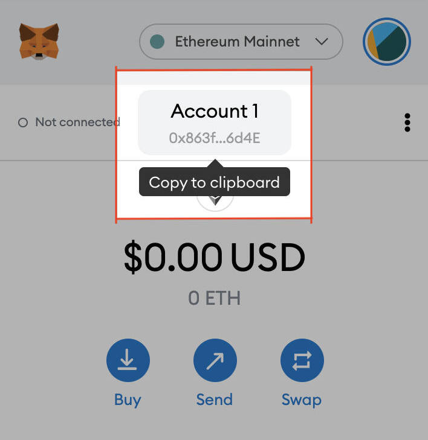

# Credit Card Purchase

### 1. Buy MATIC directly from RAMP

Go to [Ramp](https://ramp.network/buy/?swapAsset=MATIC). Select your country in the first dropdown menu, and MATIC in the second. Input the amount of money you want to buy with into the "You Pay" section. Fees and transaction details will be displayed. Click "Proceed" after reviewing them. 

Enter and verify your email address. 

You will then be asked to enter your wallet address, which can be found here. 

Choose "Card" payment and enter your information. The MATIC should arrive at your wallet within a few minutes of paying. 

### 2. Buy YAYO with MATIC

Visit [QuickSwap.Exchange](https://quickswap.exchange/#/swap?outputCurrency=0xf7058856f405542cd660e8ce4751248F2d037f2B), and click **Connect to a Wallet**.  
  
Go to the settings at the top right, and where it says "Slippage tolerance", enter 6.00%. This is just to ensure the transaction goes through smoothly.

Enter the amount of MATIC you would like to convert to YAYO and you will see your return. Then click **Swap** to process the transaction.

The purchased YAYO will now appear in your MetaMask wallet. 


If you are unable to process the QuickSwap transaction, you may be out of Matic gas. Go to [matic.supply](https://matic.supply) to receive a faucet.


