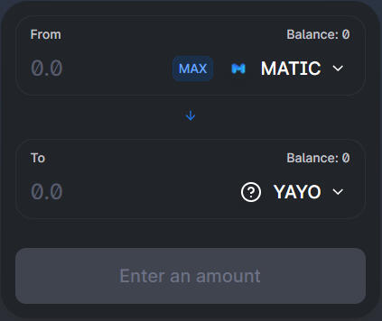

# From OKCoin or AscendEX

### 1. Buy MATIC on OKCoin or AscendEX

MATIC is available on many exchanges, but only [OKCoin](https://www.okcoin.com/buy) and [AscendEX](https://ascendex.com/en/basic/cashtrade-spottrading/btc/matic\) allow you to withdraw the MATIC on the Matic Mainnet. Using other exchanges will require a bridge. AscendEX has a 24hr hold on withdrawing funds from the time you first register. 

### 2. Send MATIC to your MetaMask

Withdraw the MATIC to your MetaMask wallet address. 

You should see the MATIC appear in your MetaMask wallet within a few minutes. 


A flat MATIC transaction fee will occur here, but the cost should be no more than a frac 


### 3. Buy YAYO with MATIC

Visit [QuickSwap.Exchange](https://quickswap.exchange/#/swap?outputCurrency=0xf7058856f405542cd660e8ce4751248F2d037f2B), and click **Connect to a Wallet**.  
  
Go to the settings at the top right, and where it says "Slippage tolerance", enter 6.00%. This is just to ensure the transaction goes through smoothly.

  
Enter the amount of MATIC you would like to convert to YAYO and you will see your return. Then click **Swap** to process the transaction.

The purchased YAYO will now appear in your MetaMask wallet. 


If you are unable to process the QuickSwap transaction, you may be out of Matic gas. Go to [matic.supply](https://matic.supply) to receive a faucet.


