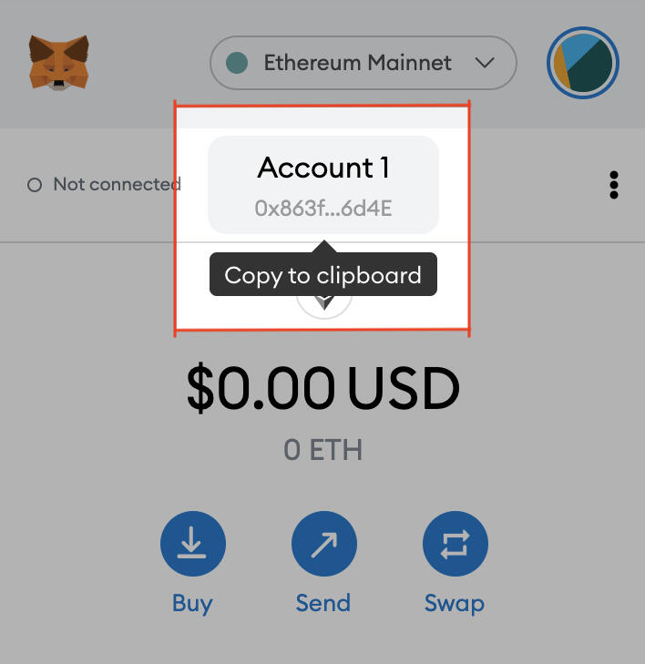
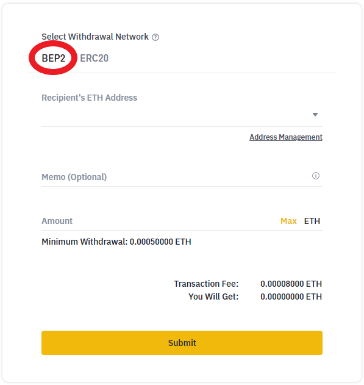

# From ETH on BSC

## Purchasing YAYO through BNB

<table>
  <thead>
    <tr>
      <th style="text-align:left">Pre-requisites</th>
      <th style="text-align:left">Total Time</th>
      <th style="text-align:left">Flat Fee</th>
      <th style="text-align:left">% Fee</th>
    </tr>
  </thead>
  <tbody>
    <tr>
      <td style="text-align:left">
        
Binance US account

        
MetaMask Wallet

      </td>
      <td style="text-align:left">5m</td>
      <td style="text-align:left">$0.50</td>
      <td style="text-align:left">2%</td>
    </tr>
  </tbody>
</table>

### 1. Purchase ETH on Binance US

ETH MUST be purchased on [Binance US](https://www.binance.us/en/trade/pro/USDC_USD) for this method to work correctly. 

### 2. Send ETH to your MetaMask over BEP2

#### Copy your Metamask Address - It can be found here.

#### Enter your MetaMask address for withdrawal. Make sure BEP2 is selected as the withdrawal network. 

### 3. Bridge token from BEP2 to BEP20 Chain

## 

## 

1. Buy USDC from Binance US
2. Send USCD to your Metamask over BSC
3. Bridge from BSC to Matic: [https://evodefi.com/bridge?token=USDC](https://evodefi.com/bridge?token=USDC)
4. Swap USDC to Matic: [https://quickswap.exchange/\#/swap](https://quickswap.exchange/#/swap)
5.  Buy YAYO with Matic: [https://quickswap.exchange/\#/swap?outputCurrency=0xf7058856f405542cd660e8ce4751248F2d037f2B](https://quickswap.exchange/#/swap?outputCurrency=0xf7058856f405542cd660e8ce4751248F2d037f2B)

