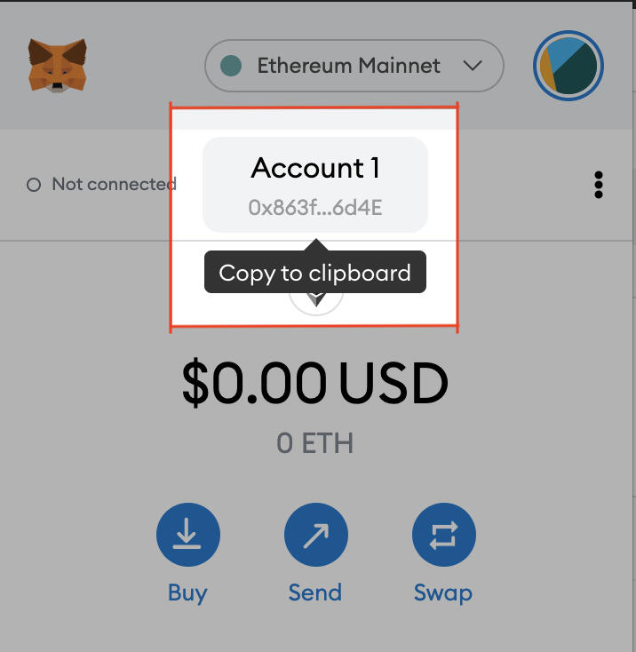

# From ETH on Exchange

This route is recommended as a universal option if you are not setup to use the other options.

## Purchasing YAYO through Ethereum

<table>
  <thead>
    <tr>
      <th style="text-align:left">Pre-requisites</th>
      <th style="text-align:left">Total Time</th>
      <th style="text-align:left">Flat Fee</th>
      <th style="text-align:left">% Fee</th>
    </tr>
  </thead>
  <tbody>
    <tr>
      <td style="text-align:left">
        
MetaMask wallet

        
Account on any US Exchange

      </td>
      <td style="text-align:left">60m</td>
      <td style="text-align:left">X Gwei ($Y)</td>
      <td style="text-align:left"></td>
    </tr>
  </tbody>
</table>

### 1. Buy ETH on the exchange of your choice

Ethereum is available on all the standard exchanges such as [Coinbase](https://coinbase.com), [Binance](https://binance.us), [Kraken ](https://kraken.com)and [FTX](https://ftx.us).

### 2. Send ETH to your Metamask

Withdraw the ETH to your MetaMask wallet address.

You should see the ETH appear in your Metamask wallet within 30 minutes.


A flat ETH transaction fee will occur here, costing X Gwei \(~$Y USD\).


### 3. Bridge ETH to Matic with Zapper Bridge

Visit [Zapper Bridge](https://zapper.fi/bridge) and click connect to wallet. Choose MetaMask..

Go to the Bridge section.

Now change to "Polygon" in the lower Network, and the Token to "MATIC".

Enter how much ETH you want to change over for buying YAYO.


A flat ETH swap fee will occur here, costing X Gwei \(~$Y USD\).


### 4. Buy YAYO with Matic

Visit [QuickSwap.Exchange](https://quickswap.exchange/#/swap?outputCurrency=0xf7058856f405542cd660e8ce4751248F2d037f2B), and click **Connect to a Wallet**.  
  
Goto the settings at the top right, and where it says "Slippage tolerance", enter 6.00%. This is just to ensure the transaction goes through smoothly.

Enter the amount of MATIC you would like to convert to YAYO and you will see your return. Then click **Swap** to process the transaction.

The purchased YAYO will now appear in your MetaMask wallet.


If you are unable to process the QuickSwap transaction, you may be out of Matic gas. Goto [matic.supply](https://matic.supply) to receive a faucet.


